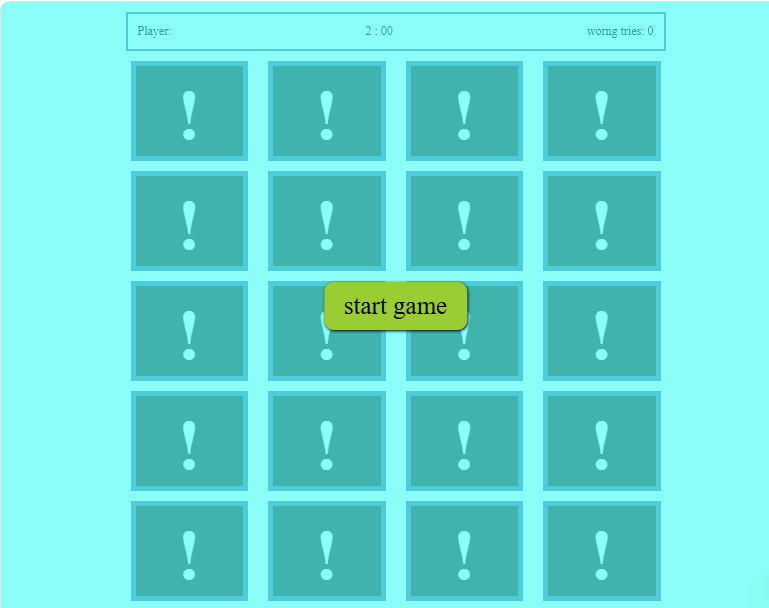

# 🧠 Memory Game

A fun and interactive Memory Game built using **Vanilla JavaScript**, **HTML**, and **CSS**. Match pairs of cards by flipping them over and testing your memory skills!


## 📦 Features

- 🧩 Flip cards to reveal hidden symbols
- ⏱️ Timer to track your performance
- 🔁 Restart button to play again
- 🎯 Tracks number of moves and matched pairs
- ✅ Responsive design for desktop and mobile

## 🛠️ Technologies Used

- **HTML5** — Structure of the game
- **CSS3** — Styling and animations
- **JavaScript (ES6)** — Game logic and interactivity

## 📸 Screenshots


## 🧪 How to Play
- Click on any card to flip it.

- Flip another card to find its match.

- If the cards match, they stay flipped.

- If not, they flip back after a short delay.

- Match all pairs to win the game!

  ---

## 🛠️ Technologies Used

| Technology     | Purpose                          |
|----------------|----------------------------------|
| HTML           | Structure of the game board      |
| CSS            | Styling and animations           |
| JavaScript     | Game logic and interactivity     |

---

## 📌 Future Improvements
- Add difficulty levels

- Include sound effects

- Save high scores using localStorage

- Add animations for matched cards

## 🙌 Credits
Developed by Your Name

## 🤝 Contributing
Contributions are welcome! Feel free to fork the project, open issues, or submit pull requests to improve the game.

## 🚀 Getting Started

To run the game locally:

1. Clone the repository:
   ```bash
   git clone https://github.com/OmarYasirR/memory-game.git
